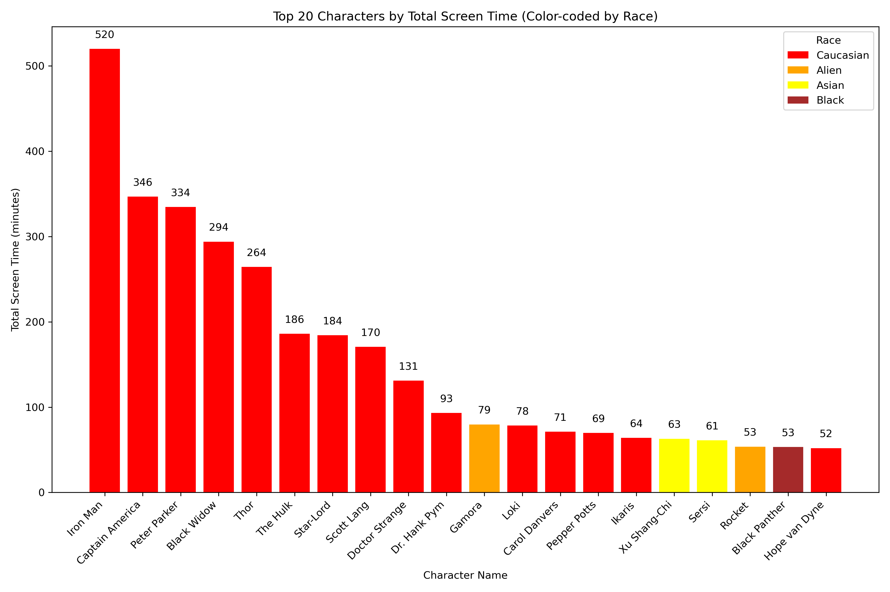
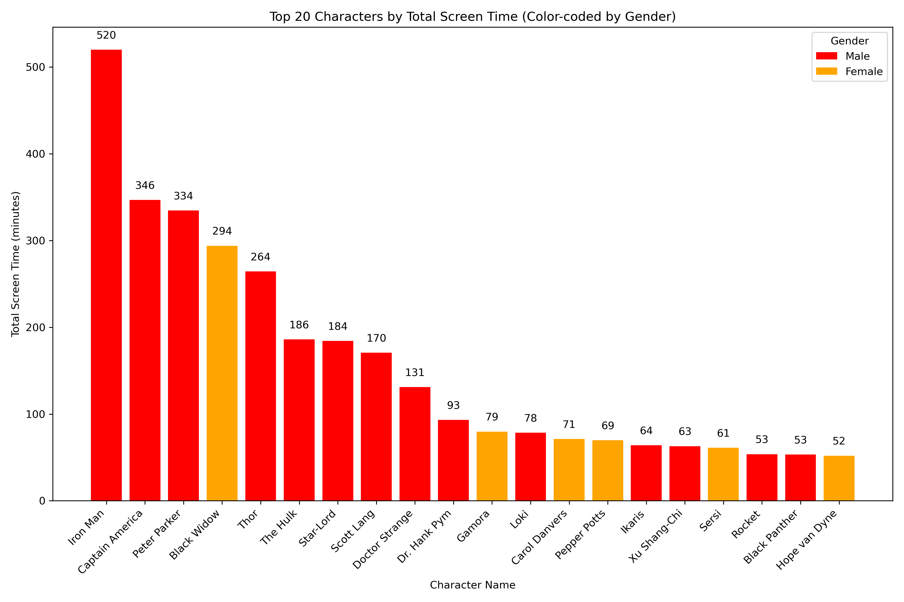
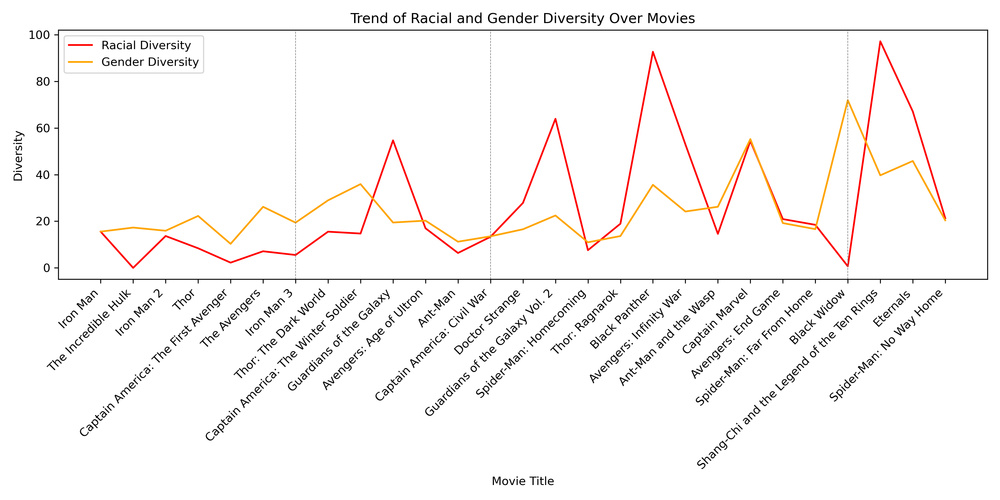
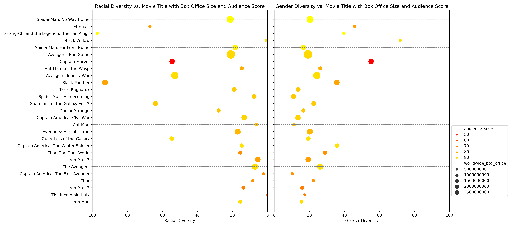
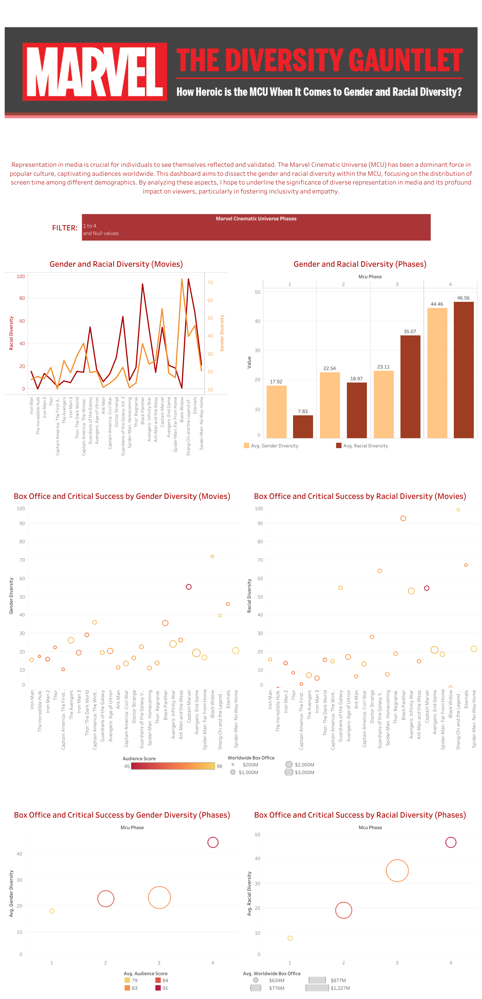

# The Diversity Gauntlet: How Heroic is the MCU When It Comes to Gender and Racial Diversity?

## Executive Summary

Representation in media is crucial for individuals to see themselves reflected and validated. The Marvel Cinematic Universe (MCU) has been a dominant force in popular culture, captivating audiences worldwide. This project aims to dissect the gender and racial diversity within the MCU, focusing on the distribution of screen time among different demographics. By analyzing these aspects, I hope to underline the significance of diverse representation in media and its profound impact on viewers, particularly in fostering inclusivity and empathy.

Unfortunately, except for ensemble films, each movie in the initial two phases of the Marvel Cinematic Universe featured a white male lead, a fact that did not escape audience notice. As the franchise gained popularity, numerous articles began to highlight the glaring lack of racial and gender representation within the MCU. Has this criticism led to the MCU becoming more inclusive, and can any trends be seen in terms of audience ratings and box office success as these metrics have improved?

The data analytics and visualizations through this project aim to answer these questions by employing intermediate Python skills, the OpenAI API, and Tableau. Key objectives include:

Key objectives include:

1. **Generating Race and Gender Data for MCU Character Across Different Movies:** Using Open AI's API to generate gender and race data for characters.
2. **Aggeregating Screen Time of Characters by Race and Gender:** Summing up screen time of characters across movies found in a database that records screen time of each character in seconds.
3. **Creating Metrics for Gender and Racial Diversity:** Creating and calculating metrics for Gender and Racial Racial diversity. Gender Diversity is defined as percentage of screen time by female characters, and Racial Diversity is defined as percentage of screen time by non-white characters.
4. **Generating Data Visulizations**: Generating visualizations that show the key trends and insights across through python.
5. **Creating Tableau Dashboard**: Creating a Tableau dashboard to publish data and findings to wider audience.

## Data Analyzed

- **MCU Screentime Breakdown**: `meu_screentime.csv`
- **MCU Box Office and Critical Success**: `mcu_box_office.csv`
  
    *Source: Kaggle*

## Scripts

- **Data Cleaning** (`data_cleaning.py`): Inspects data through generating summary statistics, cleans data for merging the two databases, and drops excess characters not present in the first 4 phases of the MCU to decrease generation load.
- **Data Generation** (`data_generation.py`): Uses the Open AI api to generate gender and race data for characters.
- **Data Aggregation** (`data_aggregation.py`): Aggregates screen time for characters and generates diversity scores for Gender and Racial diversity.
- **Data Visualization** (`data_visualization.py`): Generates data visualizations from finalized data sets.

## Key Visuzalizations and Findings

The following section includes some key visulizations and accompanying findings generated through the analysis.

**Top 20 Characters by Screentime (Race)**

*We can note that the top 20 characters by screen time exhibits poor racial diversity, with 15 Cacuasians, 2 Aliens, 2 Asians, 1 Black character.*

**Top 20 Characters by Screentime (Gender)**

*Similarly, we can note that the top 20 characters by screen time exhibits poor gender diversity, with 14 male characters, and only 1 female character.*

**Gender and Racial Diversity Trends Across Movies/Phases**

*We can however note that gender and racial diversity have been on the rise on average over the 4 phases; however, there continues to be a discrepancy between movies in the same phase. **Additional visualizations on diversity trends can be found in the Tableau dashboard provided below in this document.***

**Comparison of Box Office Success and Critical Rating with Diversity**

*We can also note this increase in diversity for both race and gender move upwards in the reverse pyramid shape exhibited in the side by side scatterplot. However, critical ratings (color) and box office success (size) do not exhibit any clear correlation with changes in diversity. It is important to note that this is not necessarily bad news, since it shows movie producers that improving diversity does not have any negative effect on how movies perform.*

# Tableau Dashboard
To ensure that the findings of the project are accessible publicly, the final database has been visualized in a filterable [Tableau Dashboard](https://public.tableau.com/app/profile/muhammad.yousaf.dilshad/vizzes).

